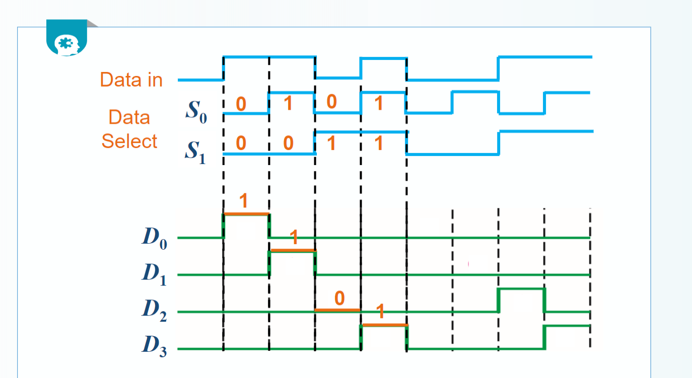

[TOC]

# 					              	数字电子技术(双语)

## Unit 01-Preliminaries(数电入门)

### 01-数字基础

1. 逻辑电平(logic levels)

+ 正逻辑中==LOW=0 ,HIGH=1==

2. 数字波形(Digital Waveforms)

  		理想情况下

+ ==占空比=(高电平时间/周期)*100%==

3. 时序图(Timing diagram)

4. 数据传输

+ 串行传输
+ 并行传输

5. BCD码(Binary Coded Decimal)

+ ==8421码 有权重的编码==

+ Gray Code(格雷码) 无权重的编码 

  ==相邻数据只有一位不同==

### 02-逻辑门电路

#### 逻辑门(logic Gates)

1. ==非门==

   

2. ==与门==

3. ==或门==

4. ==与非门== (非或门)

+ 德摩根定理

5. ==或非门==(非与门)

+ 德摩根定理

##### 德摩根定理

6. ==异或门==

7. ==同或门==

##### 通用门

+ ==与非门 或非门==可以组成任意逻辑门 被称为==通用门==

## Unit 02-Boolean Algerba(逻辑代数)

### 03-布尔代数基础

+ 交换律
+ 结合律
+ 分配律

##### Proof   A+AB=A(1+B)=A*1=A ==原变量的吸收规则==

##### 

### 04-逻辑函数的化简

##### 布尔表达式最简形式

+ 最小项之和 (SOP) sum-of-product

​	==最小项是一个乘积项，它包含表达式域中的所有输入变量。(每个字母不超过一次)==

+ 最大项之积(POS) product-of-sum

##### 卡诺图(The Karnaugh Map)

+ 单元格相邻性

+ 几何相邻
+ 环绕相邻

###### 分组原则

+ 无关项("Don't Care" condition)

### 05-逻辑函数的表达形式

## Unit 03-Combinational Logic Circults(组合逻辑电路)

### 06-组合逻辑电路的分析

##### 分析方法

1. 根据逻辑电路图得到布尔表达式

2. 画出布尔表达式的真值表
3. 分析逻辑电路的功能

### 07-组合逻辑电路的设计

##### 设计方法

1. 根据要求设计真值表
2. 根据真值表得出布尔表达式
3. 画出逻辑电路图

## Unit 04-MSI of Combinational Logic(中规模逻辑器件)

### 08-加法器

+ 半加器 不考虑进位

+ 全加器 考虑进位

+ 并行加法器

1. 串行进位

+ 超前进位加法器

### 09-数值比较器

### 010-译码器

+ 使用译码器产生逻辑函数
  1. 将逻辑表达式转变为最小项形式
  2. 找出最小项形式与译码器输出的联系
  3. 使用译码器和逻辑门产生逻辑函数

### 011-编码器

+ ==输出为反码==

### 012-多路复用器/数据选择器

### 013-多路分用器

### 014-奇偶发生器/校验器

### 015-中规模器件实现组合逻辑函数

